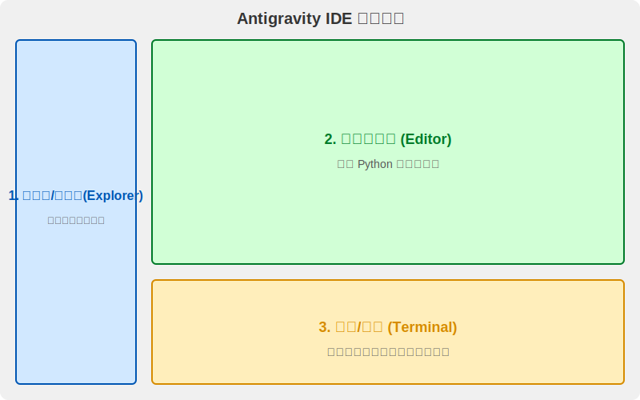
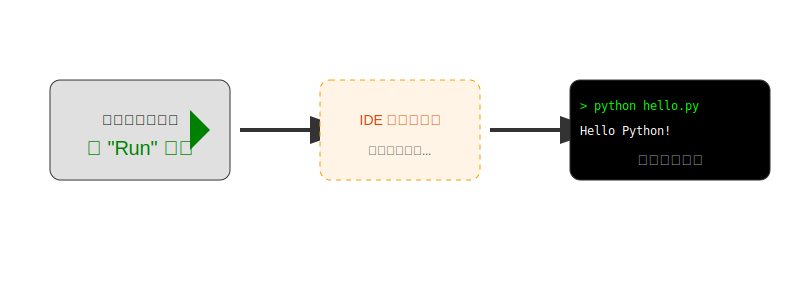
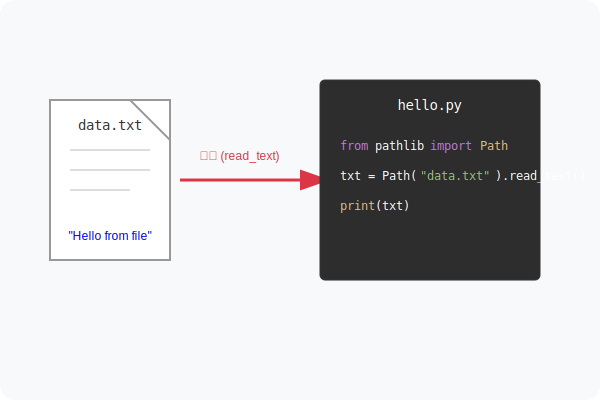

# 与 IDE 的初次对话：Antigravity 新手指南 🚀

欢迎来到 **Antigravity**！今天我们将开始你的编程之旅。

## 第 0 部分：AI IDE 的时代 🤖

在开始之前，我们先来聊聊今天的主角——**AI IDE**。

**什么是 AI IDE？**
简单来说，它是“代码编辑器 (IDE)”加上了“人工智能 (AI)”。
*   **IDE (Integrated Development Environment)**：是我们写代码的工具箱，就像画家的画板。
*   **AI**：是你的超级助手，能帮你写代码、改Bug、甚至解释复杂的逻辑。

**我想问问大家：**
> “你有没有听过 **Cursor**？有没有听过 **Kiro**？有没有听过 **Anti-Gravity** 或者 **VS Code**？”

这些都是目前市面上非常热门的工具：
*   🌍 **国外主流**：**Cursor**, **Kiro**, **VS Code** (配合 Copilot 等)。
*   🇨🇳 **国内主流**：**Trea (树)** 等。
*   🌟 **今天的示范**：我们使用的是 Google 开发的 **Anti-Gravity**。

**为什么要先学“没有 AI”的功能？**
既然 AI 这么强大，为什么我们还要学基础操作？
因为 AI 是你的**副驾驶**，而你才是**机长**。
*   如果你不懂如何起飞（运行代码）、不懂仪表盘怎么看（终端报错），当 AI 给你一段代码时，你无法判断对错，也无法让它运行起来。
*   只有掌握了 IDE 的基础，你才能真正驾驭 AI，让它为你所用。

所以今天，我们暂时关掉 AI 的魔法，先来熟悉一下这艘飞船的驾驶舱。

---

## 第一部分：认识你的控制台 (Layout) 🖥️

打开 Antigravity，你会看到一个类似飞船驾驶舱的界面。它主要由三个部分组成：



1.  **侧边栏 (Explorer)** 📂
    *   **位置**：左侧。
    *   **作用**：这是你的**文件仓库**。就像你电脑里的文件夹一样，这里列出了你项目里的所有文件。
    *   *试一试*：点击左侧的文件名，看看中间区域发生了什么变化？

2.  **代码编辑区 (Editor)** ✍️
    *   **位置**：中间最大的区域。
    *   **作用**：这是你的**工作台**。你在这里编写 Python 代码，指挥电脑做事。

3.  **终端 (Terminal)** 📟
    *   **位置**：下方。
    *   **作用**：这是你与电脑系统**直接对话**的窗口。当你运行程序时，程序说的话（比如打印的结果）会出现在这里；你对程序下达的命令也是在这里输入。

---

## 第二部分：Hello Python! (创建你的第一个脚本) 📝

让我们开始动手吧！

1.  **新建文件**：
    *   在左侧 **侧边栏** 的空白处右键，选择 `New File`。
    *   起名为 `hello.py`。注意后缀 `.py` 告诉电脑这是一个 Python 脚本。

2.  **编写代码**：
    *   在中间的 **编辑区** 输入以下代码：

```python
print("Hello, Antigravity!")
```

这句话的意思是：*“请在屏幕上打印出 'Hello, Antigravity!' 这行字。”*

---

## 第三部分：按下启动键 (Running Code) ▶️

代码写好了，怎么运行它呢？通常有两种方式，**理解它们的区别非常重要**。



### 方式 A：点击界面上的 "Run" (▶) 按钮
这是最简单的方式。通常在这个窗口的右上角有一个三角形的播放按钮。
*   **动作**：你鼠标点一下。
*   **幕后**：IDE 会自动帮你打开终端，并帮你输入运行命令。

### 方式 B：在终端手动输入命令 (黑客风格 🕶️)
有时候我们需要更精准的控制，这时就要自己动手了。

1.  点击下方的 **终端 (Terminal)** 区域，确标光标在那里闪烁。
2.  输入这个命令：
    ```bash
    python hello.py
    ```
3.  按下 **回车键 (Enter)**。

**发生了什么？**
*   `python`：这是在呼叫 Python 解释器（翻译官）。
*   `hello.py`：这是告诉翻译官要去读哪个文件。
*   终端会回复你：`Hello, Antigravity!`

---

## 第四部分：终端与环境 (Your Environment) 🌍

在终端里，你就是指挥官。除了运行 Python，你还可以问电脑一些问题。

试着在终端输入：
*   `pwd` (Print Working Directory): *"我现在在哪个文件夹？"*
*   `ls` (List): *"这里面都有哪些文件？"*

⚠️ **重要提示**：
如果在运行 `python hello.py` 时报错说 `python: command not found`，这说明你的 IDE 还没有配置好 **Python 环境**。
*   就像汽车需要引擎，IDE 需要知道 Python 安装在哪里才能跑代码。
*   通常在 IDE 的右下角或设置里，你可以选择 "Select Interpreter" (选择解释器)。把它指向你电脑上安装的 Python (比如 Python 3.9+)。

---

## 第五部分：读取秘密文件 (Import & Read) 📂

现在的程序有点无聊，只是打印我们写死的一句话。让它来读读文件吧！



### 1. 准备数据
*   在左侧 **侧边栏** 新建一个文件，叫 `data.txt`。
*   在里面写上那句经典的电影台词：
    ```text
    I'm going to make him an offer he can't refuse.
    ```
*   保存文件。

### 2. 编写读取代码
回到 `hello.py`，我们将代码修改如下。我们需要用到一个强大的工具箱（模块）叫 `pathlib`。

```python
# 1. 导入工具箱：我们需要 pathlib 里的 Path 工具
from pathlib import Path

# 2. 找到文件：告诉 Path 我们的文件叫什么
file_path = Path("data.txt")

# 3. 读取内容：把文件里的文字读出来，存到 content 变量里
content = file_path.read_text()

# 4. 打印出来
print("文件里的秘密是：")
print(content)
```

### 3. 运行它！
再次在终端输入 `python hello.py`。
你应该会看到终端输出了 `data.txt` 里的那句话！

---

### 恭喜！ 🎉
你已经掌握了 IDE 的核心用法：
1.  **写代码** (Editor)
2.  **管文件** (Sidebar)
3.  **下命令** (Terminal)
4.  **引模块** (Import)

接下来，准备好迎接 Week 1 的挑战吧！
